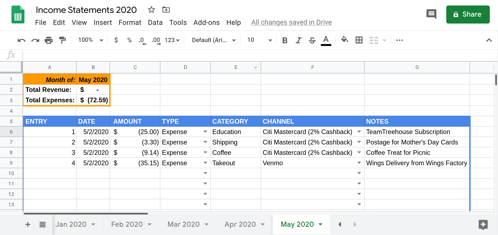

# Financial Literacy 101

## Lesson Flow
* Disclaimer
* About Me
* Introduction
  * Increase Income
  * Eliminate Debt
  * Reduce Spending
  * Save the Surplus (Parkinson's Law)
* Increase Income
  * Get a New Job
  * Get a Raise, or Promotion with Raise
  * Get a Side Gig
  * Sell Things (Things you own or Things you make)
* Eliminate Debt
  * Debt Snowball vs. Debt Avalanche
  * Lower your Interest Rates
  * Transfer your Balance to 0% Interest Cards
  * Increase your Credit Limits
* Reduce Spending
  * Create a Zero-Based Budget, or "Every Dollar Has a Name"
  * Track your Spending
  * Define What's Essential
  * Detect What's not Necessary
  * Trim the Waste
* Save the Surplus
  * Parkinson's Law
  * Basic Emergency Fund ($1,000)
  * Post-Debt Emergency Fund (3 to 6 months of Essential Expenses)
* Invest More (15% to 25% Gross Income)
  * Index Funds (No / Low Expense Fee  Ratio / No Load) vs. Managed Funds
  * 401k (minimum to at least company match)
  * Roth 401k
  * Rollover funds from previous jobs to IRA
  * Bridge Account (Taxable Brokerage Account)
* Dream Big(ger)

## Disclaimer
This information is posted and/or shared for educational and entertainment purposes only. **I am NOT a financial professional, and I AM NOT currently, and WILL NOT be responsible for any harm that comes to you, financial or otherwise, through the use of this information in your life or the lives of others, via any technology known or yet to be developed, in perpetuity throughout the universe.**

## About Me
Hello! I'm Jose Vila, and despite that disclaimer, I promise - I'm not a scary person.

I am an alumnus of the Pursuit Android 3.3 cohort, have worked as a professional software engineer since September 2017, and still do so to this day. I also worked as the Assistant Android Instructor for the Pursuit Android 4.4 cohort, and the Lead Android Instructor for the Pursuit Android 5.4 cohort. I am currently completing an Accelerated MBA Masters program in good standing through LSU Shreveport, with a concentration in Project Management.

Prior to that, I had worked a lot of minimum wage jobs, or temp-work positions, despite having a Bachelor's degree. I know what it's like to live from check-to-check, and after working with Pursuit - first as an Android fellow, and now as a former employee and volunteer, I'm looking forward to continue to help others avoid the same fate (please see disclaimer above though).

## Introduction

First, we should probably address the question at hand: 

What is Financial Literacy?

According to [Investopedia.com](https://www.investopedia.com/terms/f/financial-literacy.asp):

> Financial literacy is the ability to understand and properly apply financial management skills. Effective financial planning, properly managing debt, accurately calculating interest, and understanding the time value of money are characteristics of being financially literate.

For today's lecture, we're going to talk about four (4) main topics within Financial Literacy - we'll discuss how to:
  * Increase Income;
  * Eliminate Debt;
  * Reduce Spending; and
  * Save the Surplus (Parkinson's Law)

These topics will explore how creating a surplus, or extra money after expenses, will allow you to save up an emergency fund to use when a medical or financial emergency comes up, and you can't lean on credit card debt to deal with it. A surplus will help you pay off debt quicker as well, which will allow you to save and invest more in the long run. Only when you have a surplus of income, will you be able to become truly financially independent. A surplus occurs only when you are able to ***save more than you spend or earn***. 

## Increase Income

### Get a New Job
As Pursuit fellows or graduates, you are already aware of how important this step truly is. The sad truth is that in order to eliminate debt and reach financial independence, you'll need a job or career that will increase your income tremendously. In May of 2016, which is when I applied to Pursuit, I was making around $14.14 per hour. With a bachelors degree, and at the age of 35. When I was accepted into Pursuit in August 2016, I had made some moves, and was promoted at my company to a salary of $35,000 a year, at the age of 36. When I completed Pursuit, and joined the tech ecosystem as a Software developer, I negotiated a $105,000 annual salary. In a matter of one year, I shifted from making $28,280 a year - to at least $105,000 a year: that's an increase in gross salary of 271%, or 3.7 times my original salary!!!

### Get a Raise, or Promotion with Raise
If getting a new higher-paying job is not feasable at the moment, then the next best thing would be to increase your income at your current job. As mentioned earlier, I was able to shift my gross income from $28,280 a year to $35,000 by getting a promotion at the company at which I was working at the time. That increase allowed me to save more money, and better eliminate debt. However, because I did not reduce my spending, my spending habits increased with an increase in my income, and so the benefit was reduced (more on that later). The important point is that an increase in salary at your current company or position can be a useful way to increase your overall income, and thereby improve your financial situation. This change is what the personal finance advisor Ramit Sethi describes as the "Big Win", or rather a more substantial change in income, rather than coupon-clipping or cutting out minor expenses to increase your overall income.

### Get a Side Gig
If you are unable to get a new higher-paying job, or an increase in pay at your current role, you can supplement your income with a second job, often in the gig economy. Though these jobs aren't ideal, they can be a great way to increase your gross income, and reduce any debts / increase your surplus, especially for an emergency fund (more on that later).

### Sell Things (Things you own or Things you make)
If you still have debts, expenses, or have yet to add to an emergency fund, then you'll need to be creative if you're unable to increase your income in the previously described ways.

You can start by selling things you own that are no longer of use to you, but are still profitable in the second-hand retail market. Things like books, albums/CDs/DVDs/BlueRay discs, technology (both old and new), video game systems/games, clothing - anything that you can sell that won't put put your life, or the lives of others, at physical, emotional, or psychological risk. So, DON'T sell your personal food or blood plasma, for example. But DO sell your Fast and Furious DVD collection (for multiple reasons).

If you are crafty, you can create resources for sale: lesson plans, artwork, websites / mobile apps, kindle books, Vlogging or Blogging income (ad revenue, affiliate marketing, Patreon donations, etc). This is referred to as Passive Income, or income that requires very little initial effort, but can earn you income in your sleep without any new intervention once it has been created. I make around $10 to $20 a month from a website that sells powerpoint presentations, and I've been earning that amount monthly since I first started doing it ***BACK IN 2011***. That income goes straight into my "Holiday Gift" Fund for friends and relatives, and I don't even notice it until December when I have to use it. It's pretty sweet. 

## Eliminate Debt
Eliminating debt should be the first thing you concetrate on saving up for (only after you fill up a $1,000 emergency fund though - but more on that later).

This is important - you do nothing fun until your basic emergency fund is filled ($1,000), and then your debts, are eliminated. You are still allowed to go on cheap dates, or buy holiday gifts, but this essentially means NO lattes or avocado toast, no movies or VOD, and definitely no video subscription services. We'll talk more about tracking your spending and eliminating waste in later sections, but just keep this in mind, since ***you can't have a surplus if you still have debt***.

### Debt Snowball vs. Debt Avalanche
So, there are two major approaches to eliminating debt - the Psychological way (Debt Snowball), and the Mathematical way (Debt Avalanche). 

The "Debt Avalanche" method involves assessing all of your debts, organizing them by interest rate (the additional you owe to the bank outside of the principal every month), then concentrating all of your efforts into paying off the debt with the ***HIGHEST INTEREST RATE*** in full first (while paying only the minimum payments for all other debts), then the debts with progressively lower interest rates next. Although this technique works in theory, since you will be paying less debt in the long run, it is very, very hard to stick to. This is because since the interest rates are so high, most of your payments will go toward the interest, and not the principle, meaning although you're paying more, it just won't look like it, which may affect your emotional capacity to stick with the debt repayment plan.

The "Debt Snowball" method, however - will have you concentrate all of your efforts on paying the debt ***WITH THE LOWEST BALANCE*** in full first, (while paying only the minimum payments for all other debts), then the debts with progressively higher balances next. Although this will take longer, there is more psychological gratification in the short run, which may encourage you to stick with the plan longer, and ultimately eliminate your debts for good. This method was popularized by the financial expert Dave Ramsey, as a part of his "7 Baby Steps to Wealth" program.

### Lower your Interest Rates
While you still have debt, as long as you've always paid your bills on time, you can call your credit card company or loan provider, and ask to either lower your monthly APR, or refinance, respectively. It's possible they won't let you, but if they do, it will allow you to lower your total debt over time, which in turn will allow you to increase the rate at which you can eliminate your debt. The best part is that it's literally just a phone call away.

### Transfer your Balance to 0% Interest Cards
If you're following the Debt Avalanche method, then you've decided to focus on eliminating the debt with the lowest balance first. Great work! However, there's no guarantee that the debt with the lowest balance wil also have a lower interest rate. What if there where a way to stick with the "Debt Snowball" method, while also enjoying the mathematical benefits of the "Debt Avalanche" method? Enter - the 0% Interest Rate Transfer Balance! If your credit score is high enough, you may qualify for a new card that offers 12-to-18 month grace periods with 0% interest on all debts transferred to the account! Since the plan is to pay off this debt immediately, and the debt is already the lowest, you'll never have to pay the debt at the new interest rate after the grace period ends (if the grace period is long enough and the debt is low enough), and you can avoid having to pay the higher interest rate on the original card in the long run as well!

### Increase your Credit Limits
If you're unable to lower your APR's for your credit cards, or are unable to qualify for a 0% transfer balance offer, it's likely because your credit score is too low to qualify. It's a catch-22, I know - if you can raise your credit score by eliminating debt, but your interest rates are too high to pay down your debt faster, how can you get a higher credit score to qualify for a lower interest rate?! Well, your credit score is determined by a number of factors, such as your ability to make regular payments, your overall total debt, and your ***Debt-to-Credit Limit Ratio***. This ratio is determined by your total Credit Card debt, divided by your total Credit Card debt limit.

For example, let's say you have a credit spending limit of $20,000, but have maxed out your credit cards - then your Debt-to-Credit Limit Ratio would be:

```
20,000/20,000 = 1
```

or, 100% of your credit allowance is utilized. Creditors see this as a risky investment, and being the kinds of companies that they are, they will charge you a higher interest rate now, to make up for the possibility that you may not be able to pay your total debt in the future. However, the lower the ratio, the less-riskier of a borrower you appear to be, and so they'd be more willing to work with you at that point. For example, let's say you still have a limit of $20,000, but only $2,000 in total debt - that would give you a ratio of:

```
20,000/2,000 = .10
```

or, just 10% of your credit allowance is utilized. There are only really two ways to change this ratio:

* Lower your debt; and/or
* Increase your Credit Spending Limit

If you increase your credit spending limit, even without a change in total debt, you can reduce your ratio by 20%:

```
20,000/25,000 = .8
```

or 80% in credit utilization. This can have a positive effect on your overall credit score, which may help to lower interest rates in the long term. You might be asking yourself "Why would they give me more credit, if I'm already a credit risk?" This is because they are making a gamble that you will stick to your old ways, and max out your account again, allowing them to make even more money on your already high APR! Evil, right? As long as you continue to pay down your debts, and do not increase your spending - you'll be on your way to financial independence.

## Reduce Spending

### Create a Zero-Based Budget, or "Every Dollar Has a Name"

Also popularized by [Dave Ramsey](https://www.daveramsey.com/blog/how-to-make-a-zero-based-budget), the Zero-Based Budget allows you to be a mindful spender, and built around the axiom that you should ["Pay Yourself First"](https://www.nerdwallet.com/blog/finance/pay-yourself-first-reverse-budgeting-explained/) (though it differs from reverse budgeting in practice, since reverse budgeting is automated), in other words, you need to treat saving for yourself as a line-item on a budget, or an expense in its own right.

This means making sure that "Every Dollar has a name" - in other words, no mindless spending. A subscription, for example, is a form of mindless spending, since it can get taken out every month without you even having to think about it. Other forms of mindless spending include impulse purchases at the supermarket, or in-app purchases. However, if you set limits to each of these categories of spending the moment you get your check, and make sure you only buy things you can afford within that paycheck period, you'll be able to save every month by accounting for any extra money you would normally spend as ***a set savings expense***. For example, under this method - let's say you make $1,000 a month after taxes, and have $1,000 of credit card debt. Breaking it down by expenses you might have something like this:

|Expense|Amount|
|-|-|
|Rent|$500|
|Utilities|$100|
|CC Minimum Payments|$50|
|Groceries|$120|
|Transportation|$120|
|Total Expenses|$890|
|Leftover|$110|

You might think "Hey! I have money left over for fun stuff!" Well, if you simply spend the leftovers on non-expenses, it will disappear, and your financial situation will never change, since you will simply break-even. This means that ***what you spend is equal to what you earn***. If you were a business - you'd simply be making enough money just to keep the lights on - which means your business would not be profitable: ultimately, ***the point of a business in a capitalist society is to maximize profits*** - and if there is no profit, there is no point to a business. In humans, this break-even point can be a painful source of existential dread - "All I do is make enough money to get by!" That's how I felt back in 2016, simply living from check-to-check, maxing out credit cards, and only paying the minimum every month. Had I followed a Zero-Based Budget, I would have been able to eliminate credit-card debt sooner, regardless of income.

Assuming our budget example had a line-item to "paying yourself", we could reassign the "Leftover" as "Savings" or "Debt Repayment", along with already paying the Minimum balance (which only covers the interest payments):

|Expense|Amount|
|-|-|
|Rent|$500|
|Utilities|$100|
|CC Minimum Payments|$50|
|Groceries|$120|
|Transportation|$120|
|Debt Repayment|$110|
|Total Expenses|$1,000|

With this plan, we'd be able to eliminate this example person's credit card debt in under 10 months, and that's at a net anualized salary of only $12,000 a year!

By the way, when we say "gross" vs. "net" - "gross" is your salaried earnings ***BEFORE*** taxes and medical benefits fees are deducted from your paycheck, while "net" is your salaried earnings ***AFTER*** taxes and medical benefits fees are deducted from your paycheck.

An extension on the concept of a Zero-Based budget is the "Envelope" Method, or breaking down your spending into seperate envelopes or bank accounts. For example, you can set a "fun" envelope, where you set aside $20 a month for treats to tide you over, and save only $90 a month for debt repayment, allowing you you pay off your debt a month later, while still giving yourself the opportunity to let off a little steam with retail therapy. However, once the cash is spent from the "fun" envelope or account - that's it! No more dipping into your surplus, since there is no longer a surplus, because "Every Dollar has a Name," or a pre-set assignment every month!

You can also treat this as a ***sinking fund*** - a sinking fund is used in business to buyback bonds whenever the money to buy them back becomes available, but in personal budgeting, a sinking fund is a great way to save for pre-set things you want to buy, like gifts for relatives during the holidays, or a larger purchase down the line - think of it as "layaway" - but without giving it to a specific retail store to hold on to it first.

|Expense|Amount|
|-|-|
|Rent|$500|
|Utilities|$100|
|CC Minimum Payments|$50|
|Groceries|$120|
|Transportation|$120|
|Debt Repayment|$90|
|Retail Therapy|$10|
|Sinking Fund (New Phone)|$10|
|Total Expenses|$1,000|

### Track your Spending
Before you can get to that point of surplus, and in turn the zero-based budget, you'll have to first analyze your current spending habits. The best way to do this is to come up with a version of what businesses call an "income statement". This is a list of all of your "revenue" and "expenses", or items/bills you spend money on, and income you've earned. In 2020, this is actually quite simple, since all banks and credit cards have online statements that update with pending and completed transactions every time you make a purchase. You can use a simple spreadsheet in google sheets to chart expenses, and track totals:



As you can see - three days in, and I'm already ordering a bit of takeout (coffee, wings, etc). What I can do is track this trend for a month, then make sure I spend no more than 80% of this month's takeout spending in the next month, by limiting the amount of cash I deposit into my "Takeout" envelope, or in my case, an Ally Checking account I created just for my takeout expenses for the month. Once I hit 90+ percent of my monthly limit, I just stop buying takeout, which should give me a surplus I can then allocate to either savings, my MBA tuition, or a sinking fund of my choosing (like for something I'd like to buy myself for my birthday!). At the end of the month, total revenue minus total expenses should equal **ZERO**. I should "break-even", which is okay, because I also treat savings as an expense, and income as revenue, or money coming in for the month.

I record itemized credit card expenses on the day they are charged, NOT the day that I will pay my credit card bill for several reasons:
1. I want to see exactly what I buy, and when I buy it; and
2. According to Generally Accepted Accounting Principles, or GAAP:
> "Revenues are recognized when realized and earned, not necessarily when received." ~ [Investopedia.com](https://www.investopedia.com/ask/answers/06/recognizingrevenues.asp)

So for example, even though rent is due on the 1st of the month (May 1st), I get paid on the last day of the month, so I transfer money to my Bills checking account, and send my portion of the rent via "Zelle" on that day. Therefore, since those actions were performed at the end of April, I do not record them for the month of May - I record June's rent payment at the end of May instead.

If you don't want to do this manually, you can use websites like Mint.com, Personal Capital, or YNAB, among others. However, there is a tradeoff in privacy, and you might not want all of your finances available in one place. Ultimately, it's up to you how you track your expenses, as long as you track them accurately.

### Define What's Essential
After tracking your spending, it's important to identify what is essential: likely it will be groceries, rent, utilities, the mobile phone bill, minimum credit card payments, minimum student loan payments, metrocards, etc. Once these are identified, add them all together. The sum total of these will be equal to your ***Monthly Essential Expenses***. Remember this number, as it will give you a goal to save for when we discuss saving up for a long-term emergency fund.

### Detect What's not Necessary
Effectively, anything that's not essential, is discretionary. In other words, if you didn't spend money on these things, no one would die, or get hurt, or sick, or lose their job, or anything serious. That's different from the essentials - we all need electricity, internet, medicine, heat, light, water, food, and transportation to get by. We don't actually NEED chicken wings, or movie theatre tickets.

### Trim the Waste
This can be hard, but it is necessary. After tracking your budget for several months, you'll come to realize that a lot of what you consider essential, is not actually essential. Once you've discovered what's discretionary, split them into different concrete categories (takeout, date night, movies, shoes/clothing, etc.), and begin a ***reduction exercise***. For every dollar you spent this month on that category, spend $0.20 cents less next month. So for the previous example - if I spent $100 on takeout in April, I should spend no more than $80.00 in May, no more than $64 in June, no more than $51.20 in July, and so on, until your $1,000 emergency fund is filled, and your debts are eliminated. Once you are debt free, you can ease up on the spending reduction a little bit, but you'll still need to save 3-to-6 months of essential expenses for your full emergency fund.

## Save the Surplus
Remember when we discussed creating the surplus, but then giving it a name and treating it as an expense? After we've trimmed the waste, hopefully reduced our interest rates, and hopefully increased our income in some way, we can finally begin to save and invest our money to help us gain financial independence.

### Parkinson's Law
There's a reason why we need to assess our income and spending habits, and create a budget based around them to course-correct, and it's because of a phenomenon called ***Parkinson's Law***:
>"This law says that, no matter how much money people earn, they tend to spend the entire amount and a little bit more besides. Their expenses rise in lockstep with their earnings. Many people are earning today several times what they were earning at their first jobs. But somehow, they seem to need every single penny to maintain their current lifestyles. No matter how much they make, there never seems to be enough." ~ [BrianTracy.com](https://www.briantracy.com/blog/financial-success/parkinsons-law/)

Also known as "Lifestyle Creep", somehow certain things were deemed essential, required, and even affordable, but ended up becoming a liability in that, at any income level, if a person's spending equals or exceeds their income, without accounting for savings or essentials, they will feel like they are living check-to-check. The [HENRY Phenomenon](https://www.businessinsider.com/what-is-a-henry-millennials-earning-six-figures-feel-broke-2019-11) is a perfect example of this.

For the HENRY's of the world, it's "keeping up appearances", for everyone else, it's not accounting for unnecessary spending, or not being prepared for financial emergencies - in other words, using a credit card to pay for something essential when it became an emergency, rather than saving for that emergency in advance, knowing that it would of course eventually come.

### Basic Emergency Fund ($1,000)
According to the [Federal Reserve and CNBC](https://www.cnbc.com/2019/07/20/heres-why-so-many-americans-cant-handle-a-400-unexpected-expense.html), "Some 40% of Americans would struggle to come up with $400 for an unexpected expense." This means paying for an emegency of at least $400 dollars in cash. Sure, they might be able to pay it with a credit card, or by borrowing from a friend or loved one, or maybe even a 401k, but not from their own savings. These emergency costs can balloon into greater debt if not kept in check, and can lead to foreclosure, loss of employment, loss of a car, even imprisonment in some sad cases.

With an emergency fund, these emergency debts can be resolved quickly, even while earning minimum wage. This is why it's important to have an emergency fund of at least $1,000 in cash or in a checking/savings account. In fact, before eliminating debt, you should take any and all surplus after increasing income and decreasing expenses, and deposit it into your emergency fund. 

I repeat: ***Do not put any surplus into anything else until this is done first!***

### Post-Debt Emergency Fund (3 to 6 months of Essential Expenses)
Once the $1,000 emergency fund has been maxed out, and you have successfully paid off all of your debt using the ***Debt Snowball*** method, use any excess money you would have spent on paying off debt, and any surplus in income you may have left over after expenses, to ***build up your emergency fund to 3-to-6 months of emergency essential expenses!*** This is considered "Baby Step Number 3" in Dave Ramsey's "7 Baby Steps" program.

In the previous hypothetical example of the $1,000 wage earner - their essential expenses included: Rent ($500), Utilities ($100), Groceries ($120), and Transportation ($120) - with the sum total being $840 of essential expenses per month. This means that this person would have to save anywhere between $2,520 (three months) and $5,040 (six months) of emergency savings to be financially secure during a major financial crisis - like a layoff, or an emergency medical procedure. Some financial experts, like Suze Orman, believe that this number is actually too low, and that it [should be something closer to 8-to-12 months of essential expenses](https://www.cnbc.com/2018/06/13/how-much-money-suze-orman-says-to-have-in-your-emergency-fund.html) for true financial security!

## Invest More (15% to 25% Gross Income)
It is recommended that no one invest their money until all debts are paid off, and all emergency funds are maxed out (3-to-6 months of expenses). However, once the prerequisites have been met, it's time to move from financial security, to financial independence! However, this can only be done by not just saving, but investing.

This is because of something called inflation - or the general increase in prices, and the fall in the purchasing value of money. This means that as the price of items increases over time, a consumer's buying power decreases over time as well. In real terms - if a person left $100 in a no-interest checking account for the next 40 years, at an estimated inflation rate of 2.5 percent, in the year 2060 that $100 would actually have about the same buying power as $37 dollars in today's economy! This is why it's important to increase the rate at which your savings can grow, to well above the rate of inflation.

### Index Funds (No / Low Expense Fee  Ratio, No Load) vs. Managed Funds
Although individual stocks and bonds, when picked correctly, can be quite profitable in both the short and long term, the truth is that no one who is not regularly watching the market and digesting stock news hourly can accurately time the market. Companies like Acorns, Stash, and Robin Hood make money by charging you fees on small stock purchases which will likely turn-up as a wash in a few years.

This is why most (if not all) retirement plans tend to have a more diversified portfolio in the form of ***mutual funds*** for long-term investments, to ride out market volatility. A mutual fund is an account that is actively managed by a financial advisor on your behalf, and includes a number of financial assets, usually publically traded assets like stock and bonds, to manage risk and increase the chances of the investment growing reliably over time. However, managed funds tend to cost more in fees, and any gains above inflation may be eaten away by these additional fees. In fact, for all the supposed work that they do, these "managed" funds tend to rarely (if ever) beat the general growth rate of the market over the long term, which is about a 5%-to-10% rate-of-return depending on which years you measure. In fact, the market can be so volatile that even professional fund managers often [can't beat an actual cat's random stock picks for a whole year!](https://www.npr.org/sections/money/2013/01/14/169326326/housecat-beats-investors-in-stock-market-challenge)

This is why investment moguls like Jack Bogle, Warren Buffett, and Charlie Munger among others suggest that most investors stick with low to no Expense Ratio fee, no-load index funds that follow the market over the long term, such as S&P 500 or Total Domestic Stock Market funds from Vanguard or Fidelity, which allow you to keep more of what you earn by avoiding unnecessary manager fees, and giving you the opportunity to reinvest your dividend earnings, leveraging the power of compound interest (the same compounding that credit card companies use to make a profit off of your debt!).

### 401k (minimum to at least company match)
If you are lucky enough to work for a company that offers a 401k, and you've already eliminated debt and maxed out your emergency funds, take advantage of this immediately. 401k accounts allow you to invest up to $19,500 of pre-tax, or gross income, per year into mutual/index funds. This means that the money you invest will grow tax-free, allowing you to invest more than you would have been able to with after-tax money. This also lowers your ***taxable income rate***, which means you are incentivized to invest, since it might drop you to a lower tax bracket, allowing you to pay even fewer taxes per year!

The only catch with a 401k (or 403b, if you work for a non-profit) is that although the money will grow tax-free, you will eventually be taxed when you withdraw the money at or after retirement. This is why you should at first only invest up to the company match, then invest in a Roth account until you've maxed the Roth out, then max out your 401k (more on Roth accounts later).

An employer match truly is a magical thing. It is actually free money that your employer gives you to invest in your retirement, based on how much you invest in your retirement. Some companies offer anywhere between 3%-to-10% as a match to your annual investment. However, what this match actually is can vary from company-to-company, where some companies interpret the match to mean a percentage of what you invest (a percentage OF your percentage), versus a percentage of your actual salary. Mileage will vary - but it is ultimately free money for the taking!

### Roth 401k
A Roth 401k is different from a traditional 401k, in that instead of allowing you to invest pre-tax dollars which will grow tax-free, you'll be investing post-tax dollars from your net income into the account. However, the reason why this is so attractive to investors is because upon retirement, any withdrawals made from this account will be free of tax-penalty (since you invested post-tax money with it), increasing your purchasing power as inflation increases the general cost of goods and services in the future. However, there are some limits - for exaple you can only invest a maximum of $6,000 post-tax income per year, and you do not qualify for a Roth account if you make more that $139,000 a year, after adjusting for your current tax bracket using your modified adjusted gross income (MAGI).

### Rollover funds from previous jobs to IRA
You might have invested in a 401k in your previous job, and forgotten about it. It might have even grown in value since you last invested in it. However, it may be investing in mutual funds with high fees that are slowly but surely cutting into any gains you might receive from the actual investment. This is why it makes sense to rollover the funds from that old 401k account, into an IRA that you yourself control.

Both 401k's and IRA's are effectively identical in pre-tax benefit except that they vary in who controls them, and how much you're allowed to invest per year. A 401k is a product that your employer offers to you as a part of your overall compensation package, while an IRA is something you can buy from an investment back, which allows you to invest for rollover pretax earnings into an account with funds which you get to choose on your own. If you roll over your old 401k funds into an IRA through a company like Fidelity or Vanguard, you have the opportunuty to invest with lower fees and higher rates of return than you might have at your old company which is no longer adding income for you to that fund.

### Bridge Account (Taxable Brokerage Account)

Once you've maxed out your Roth IRA ($6000 per year) and your 401k ($19,000 without employer match per year), you may still have money left over every month to save or invest. If this is the case, you can put your money in a Taxable Brokerage account, often called a "Bridge" Account. It's called a bridge account because it can help to "bridge the gap" between now and your retirement by allowing you to invest money that will grow over time, and is also accessible to you whenever you want to buy or sell. Currently, you can only take money out of your 401k or Roth IRA at the age of retirement, not before (NEVER take a loan out on your retirement accounts!!!). However, in a taxable brokerage account, you can make a windfall, and retire early if you wanted to, without having to be age 59 or above!

## Dream Big(ger)
Once you reached the point where you have increased your income, tracked your budget, cut unnecessary expenses, saved up a minimum emergency fund of $1,000, eliminated your debt, increased your emergency fund to 3-to-6 months of essential expenses, maxed out your Roth accounts, and exceeded your employer match for your 401k (and maxed that out as well), and selected low-to-no fee / no load index funds tracking the market average, and rolled over any external 401k's/403b's from previous jobs into an IRA completely under your control - you're well on your way reaching or exceeding your goal of becoming financially independent. Now, any excess income you make outside of your savings, expenses, and investments is truly yours to spend - you can change your living situation from a room to an apartment, maybe even a condo or a house. You can, like me, pay for a masters degree entirely in cash, or plan a guilt-free vacation without worrying about breaking the bank, getting back into debt, or sacrificing your future. Just remember, it all started with earning more, spending less than you earn, eliminating debt, and saving the rest!
